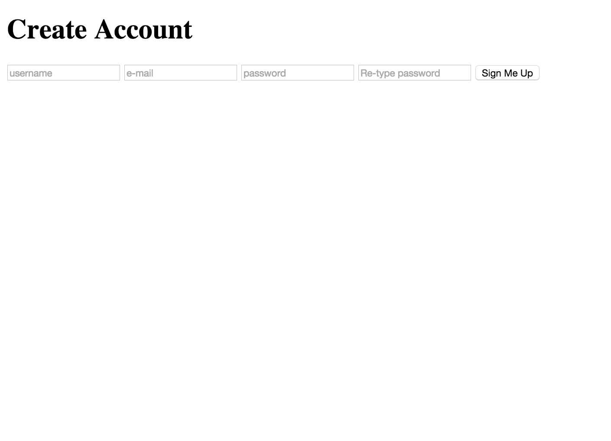
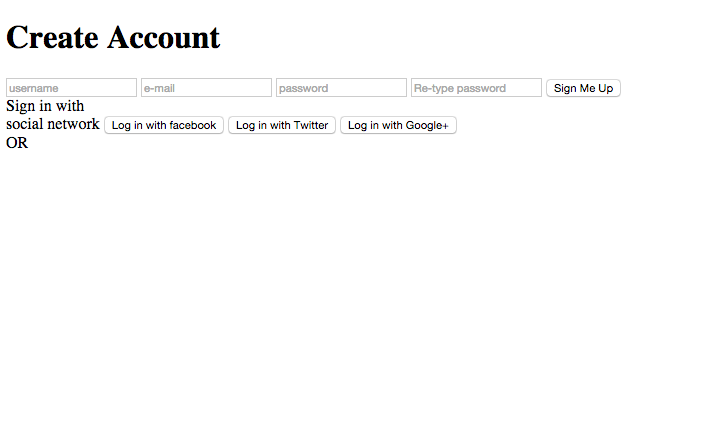
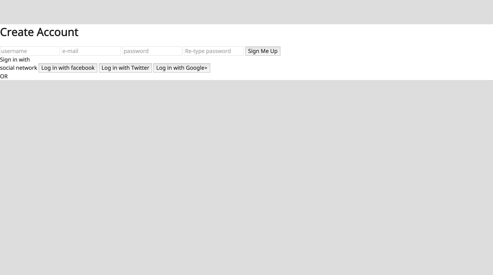
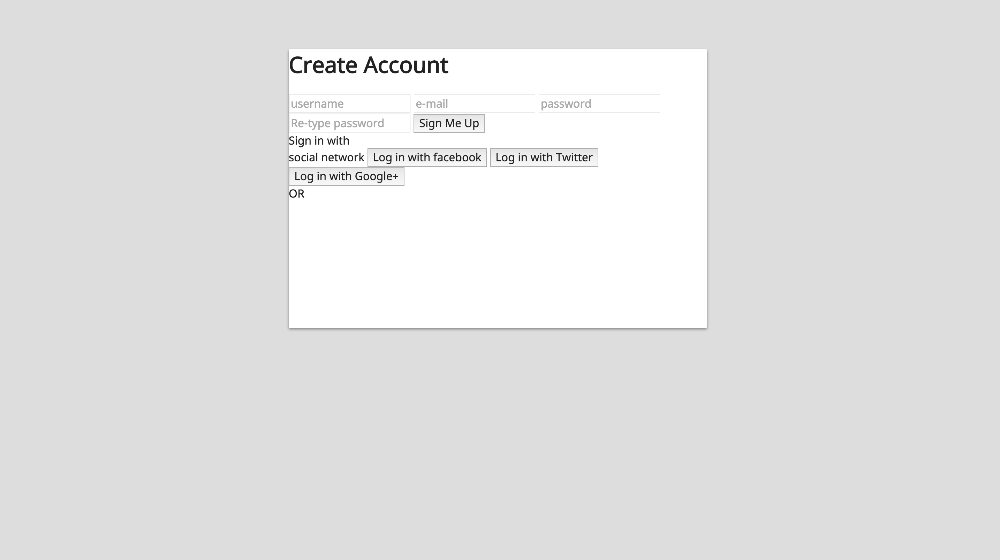
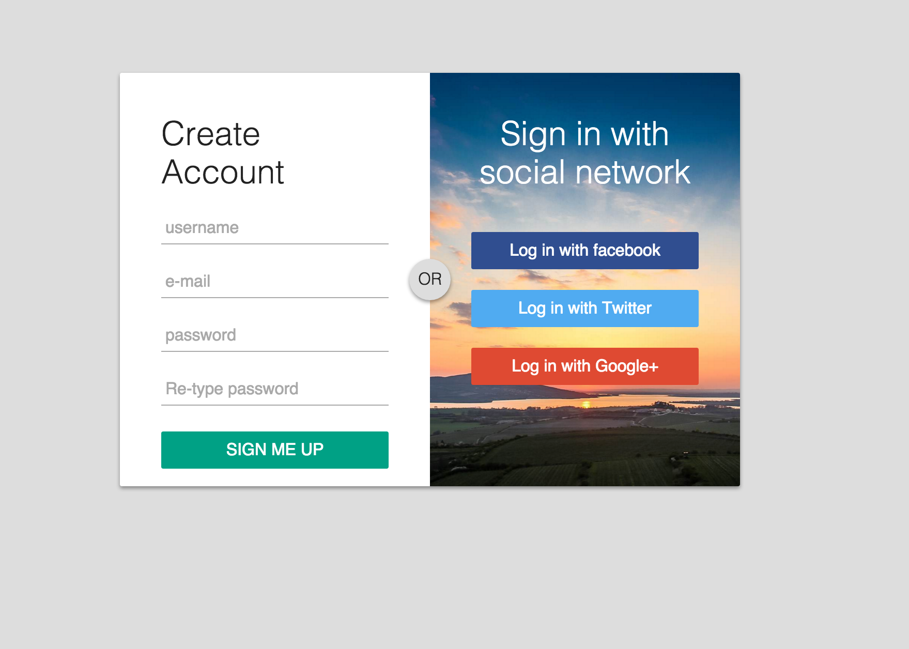

#CSS Challenge - Create a Nice Looking SignUp Form
- - - -

**Challenge 1** - Create the HTML Document

```html
<!DOCTYPE html>
<html>
  <head>
    <meta charset="utf-8">
    <title></title>
  </head>
  <body>
    
  </body>
</html>
```

**Challenge 2** - Link to your stylesheet

```html
<link rel="stylesheet" href="css/main.css" media="screen" title="no title" charset="utf-8">
```
- - - -

## Structure

When building any type of document with HTML/CSS. You always want craft the structure first and style afterwards. 

We'll start by building out the body of our document and creating the form.

**Challenge 3** - Set the Body up

- Inside the `<body>` create a container `<div>` with the `id` attribute of login-box
- Within the login-box `<div>`, create another `<div>` with a `class` of left
- Inside of the 'left' `<div>`, create a top-level header that contains the text: 'Create Account' 

<br>


```html
<body>
  <div id="login-box">
    <div class="left">
      <h1>Create Account</h1>
      
   </div>
  </div>
</body>
```
- - - -

### The Form
- - - -

**Challenge 4** - Create a sign-up Form

1. Create a `<form>` element which contains:
	2. A `class` attribute titled 'sign-up' 
	3. An `action` attribute pointing to 'index.html' <br> The *action* attibute defines the location (an URL) where the form's collected data should be sent.
	4. A `method` attribute with the value of 'post'<br> The *method* attribute defines which HTTP method to send the data with (it can be "get" or "post").
2. Nest 4 `<input>` elements within the `<form>`
	2. A username input
	3. An Email input
	4. two password inputs (one for the actual password, and one to confirm)
3. Nest a `button` (inside the `<form>`) with the following attributes:
	4. A `class` attribute of 'sign-up-button'
	5. A `type` attribute of 'submit'
4. Close out your 'left' `<div>`  	 	

*hint: You may want to check out the [Mozilla](https://developer.mozilla.org/en-US/docs/Web/Guide/HTML/Forms/My_first_HTML_form) or [W3](http://www.w3schools.com/html/html_forms.asp) documentation on how to create a form*
<br>

Once complete, your index.html page should look something like this: 

**Challenge 4 Answer:** 

```html
 <div class="left">
  	<h1>Create Account</h1>
  	
  	<form class="sign-up" action="index.html" method="post">
	  
	  <input type="text" name="username" placeholder="Username" />
	  <input type="text" name="email" placeholder="E-mail" />
	  <input type="password" name="password" placeholder="Password" />
	  <input type="password" name="password2" placeholder="Retype password" />
	
	  <button class="sign-up-button" type="submit"/> Sign Me Up </button>
	
	</form>
	
</div>
```

- - - - 

### The other buttons
- - - -

**Challenge 5** - Buttons

1. Create a `<div>` with a `class` attribute of 'right'
2. Nest a `<span>` with the `class` attribute of 'loginwith' inside of the 'right' `<div>`
	1. Inside the `<span>` put the text: 'Sign in with Social Network'
3. Create 3 `<button>`'s with:
	1. `class` attributes of "social-signin"
4. Select the top `<button>`and
	1. Assign a `class` attribute of 'facebook'
	2. Include the text: 'Log in with facebook'
5. Do the same thing for Twitter and Google+
6. close out the 'right' `<div>`

The Result:


<br>
**Challenge 5 Answer:**

```html
<div class="right">

  <span class="loginwith">Sign in with <br> social network</span>

  <button class="social-signin facebook">Log in with facebook</button>
  <button class="social-signin twitter">Log in with Twitter</button>
  <button class="social-signin google">Log in with Google+</button>

</div>
```     	 
- - - - 
### Or
- - - -

Create a `<div>` with the `class` attribute of "or" and the inner-text 'OR'

```html
<div class="or">OR</div>
```
- - - -
## HTML

Whew! You've complete the structure of the html document. Now all that's left is to add some style

Here's what your code should look like so far:

```html
<!DOCTYPE html>
<html>

<head>

  <meta charset="utf-8">
  <link rel="stylesheet" href="css/main.css" media="screen" title="no title" charset="utf-8">

  <title>Sign Up!</title>

</head>

<body>

  <div id="login-box">
    <div class="left">
      <h1>Create Account</h1>

      <form class="sign-up" action="index.html" method="post">
        <input type="text" name="username" placeholder="Username" />
        <input type="text" name="email" placeholder="E-mail" />
        <input type="password" name="password" placeholder="Password" />
        <input type="password" name="password2" placeholder="Retype password" />

        <button class="sign-up-button" type="submit" />Sign Me Up</button>
      </form>
    </div>

    <div class="right">
      <span class="loginwith">Sign in with
        <br />social network</span>

      <button class="social-signin facebook">Log in with facebook</button>
      <button class="social-signin twitter">Log in with Twitter</button>
      <button class="social-signin google">Log in with Google+</button>
    </div>

    <div class="or">OR</div>

  </div>

</body>

</html>
```

That should produce something like this:



- - - - 

# On to Style...
- - - - 


### Normalize A.K.A. - Browser Reset
- - - - 

Okay, so first things first. We *need* to get rid of this awful default browser styling

**Challenge 6** - Let's [Normalize!](https://necolas.github.io/normalize.css/) 

1. Go to the site above and download the file
	2. Create a new stylesheet and paste in the contents of normalize.css
	3. link the stylesheet to your index.html page

<br>
**Before and After:**


**Challenge 6 Answer:**

```html
<link rel="stylesheet" href="css/normalize.css" media="screen" title="no title" charset="utf-8">
```

(In the `<head>` make sure to link this above your `main.css` file. Otherwise it will overwrite all of your custom styles)

- - - - 


## Setting up the Body

Start by using the `*` selector to apply `border-box` to the all of the elements.

```css
* {
  box-sizing: border-box;
}
```

So, what does the above code do? <br> Well, according to learnlayout.com:
 > When you set box-sizing: border-box; on an element, the padding and border of that element no longer increase its width.
 
This is incredibly helpful as it removes unexpected layout issues. 


Next we'll work on the body.<br>

**Challenge 7** - colors!

1. Give the `body` a background color of `#DDD`
2. Give the text a color of `#222`

**Result:**


<br>
**Challenge 7 Answer:**

```css
body {
	background: #DDD;
	color: #222; 
}
```

While we're at it, let's go ahead and select a font (I've already picked out Noto Sans, but feel free to experiment)
 
Right below your `*` selector apply the following:
 
 ```css
 @import url(https://fonts.googleapis.com/css?family=Noto+Sans|Comfortaa:400,300,700);

 ```
 
 Now add the following to your `body` statement:
 
```css
  font-family: 'Noto Sans', sans-serif;
  font-weight: 300;
```

Which should result in the following code:

```css
body {
  background: #DDD;
  color: #222;
  font-family: 'Noto Sans', sans-serif;
  font-weight: 300;
}
```
Here's how it will look on the web:


That should take care of the body. Next positioning!

- - - -

### Positioning   

**Challenge 8 (part 1)** - The Login-Box

1. Start by giving the `login-box` a `relative` position
2. Apply a `margin` of 
	3. `5%` on the top/bottom
	4. `auto` on the left/right
3. Give the box a `background-color` of `#FFF`

<br>

**The Result you're looking for:**


<br>

**Challenge 8 (part 1) Answer:**

```css
#login-box {
  position: relative;
  margin: 5% auto;
}
```
Great! Even though, it doesn't look like much happened. The good news is that our Login Box is responding. 

**Challenge 8 (part 2)** - Now all we need to do is set a width and height and give it some style

1. Set a `width` of `600px`
2. Set a `height` of `400px`
3. Refresh your browser and make sure the box is still responding
4. Assign a `border-radius` of `2px`
5. Add some `box-shadow` and assign the following values
	6. horizontal shadow of: `0`
	7. vertical shadow of: `2px`
	8. blur of: `4px`
	9. color of: `rgba(0,0,0,0.4)`

(*hint:* you may find [this](http://www.w3schools.com/cssref/css3_pr_box-shadow.asp) helpful for box-shadow)

The Result: 


<br>


**Challenge 8 (part 2) Answer:**

```css
#login-box {
  position: relative;
  margin: 5% auto;
  width: 600px;
  height: 400px;
  background: #FFF;
  border-radius: 2px;
  box-shadow: 0 2px 4px rgba(0, 0, 0, 0.4);
}
```

Ahhh much better. Now we can start focusing on the right and left `<div>`'s

- - - - 

## Position the div's

**Challenge 9** - Position the left `<div>`

1. Give the `<div>` some `padding`, `height` and `width`
	2. padding of: `40px`
	3. width of: `300px`
	4. height of: `400px`
5. Refresh your browser <br>

6. Now, give the left div an absolute position
	7. Place it at at the top/left of it's parent `<div>`

	
(You'll probably notice all sorts of weirdness happening with the right div. Just ignore it for the moment)

```css
.left {
  padding: 40px;
  width: 300px;
  height: 400px;
  position: absolute;
  top: 0;
  left: 0;
}
```

**Challenge 10** - Position the right `<div>`

1. Apply the same `attributes` (from the .left `<div>`) to right `<div>` with one exception
	1. Position this `<div>` at the top right of it's parent `<div>` (instead of the top left)


*Thankfully, we can reuse a good bit of the code from our left `<div>`. yay!<br>
hint: see if you can refactor a little bit.*

<br>

```css
.left,
.right {
  padding: 40px;
  width: 300px;
  height: 400px;
  position: absolute;
  top: 0
}

.left {
  left: 0;
}

.right {
  right: 0;
```	


Let's go ahead and throw in our background picture while we're here.<br> In your `.right` declaration (under the `right: 0;` declaration) paste the following code:

```css
.right {
  right: 0;
  background: url('https://goo.gl/YbktSj');
  background-size: cover;
  background-position: center;
  border-radius: 0 2px 2px 0;
}
```

Refresh and take a deep breath. We're getting close!
- - - -

## Style the .left

Let's go ahead and knock out the styling on our left `<div>`

We'll start with the `<h1>`

**Type** the following code in your stylesheet:

```css
h1 {
  margin: 0 0 20px 0;
  font-weight: 300;
  font-size: 2em;
}
```

Refresh if you want to see the change

**Challenge 11** - The sign-up form

1. Let's start by removing that border
2. Now apply a border to only the bottom.
	3. give it a `1px` solid bottom-border
	4. give it the color `#AAA`
5. Refresh
6. Now, apply some margin and padding to make it look pretty
	7. Separate the inputs by adding a bottom margin of `20px`
	8. add about `4px` of `padding`
9. Refresh

10. Add some height and width...
	11. `height` of `32px`
	12. `width` of `220px`
13. Make the font a little stronger by giving it a weight of 400   

<br>

```css
.sign-up input {
  border: none;
  border-bottom: 1px solid #AAA;
  display: block;
  margin-bottom: 20px;
  padding: 4px;
  width: 220px;
  height: 32px;
  font-weight: 400;
}
```

Cool, things are starting to look decent. Let's go ahead and work on the button next. 

**Challenge 12** - The Sign Me Up Button

1. Let's properly apply spacing and width/height
	2. give a top and bottom margin of `5px`
	3. a `width` of `220px`
	4. a `height` of `32px`
5. While we're at it, go ahead and remove the border
6. give it a `border-radius` of `2px`
7. Apply some color!
	8. give the background a color of `#16A085`
	9. set the text color to `#FFF`
10. Finally, set the `transform-text` proptery to `uppercase`, and the `font-weight` to `400`
	
<br>
Here's what you should have so far.

```css
.sign-up-button {
  margin: 5px auto;
  width: 220px;
  height: 32px;
  border: none;
  border-radius: 2px;
  background: #16a085;
  color: #FFF;
  font-weight: 400;
  text-transform: uppercase;
}
```

We also want to give the button some `hover` effects to call the user to action. 

**Challenge 13**

1. Using the `:hover` pseudo selector 
	2. Set the `opacity` to `0.8`
	3. give a `box-shadow` of: `0 2px 4px rgba(0, 0, 0, 0.4)`
	4. set the `transition` property to `0.1s ease`
5. Refresh and check it out


6. Now use the `:active` pseudo selector to:
	7. apply an `opacity` of `1`
	8. and a `box-shadow` of `0 1px 2px rgba(0, 0, 0, 0.4)`

<br>


```css
.sign-up-button:hover {
  opacity: 0.8;
  box-shadow: 0 2px 4px rgba(0, 0, 0, 0.4);
  transition: 0.1s ease;
}

.sign-up-button:active {
  opacity: 1;
  box-shadow: 0 1px 2px rgba(0, 0, 0, 0.4);
}
```  

Let's put the finishing touches on this side.


**Challenge 14** - Using a `:focus` pseudo selector, apply the following code to `input`:

```css
border-bottom: 2px solid #16a085;
color: #16a085;
transition: 0.2s ease;
``` 

Once complete, you'll want to modify `focus` on the entire document. <br>

Place the following code near the top of your stylesheet

```css
*:focus {
  outline: none;
}
```

At the end of your styling you should have the following code for your left `<div>`

```css
h1 {
  margin: 0 0 20px 0;
  font-weight: 300;
  font-size: 2em;
}

.sign-up input {
  border: none;
  border-bottom: 1px solid #AAA;
  display: block;
  margin-bottom: 20px;
  padding: 4px;
  width: 220px;
  height: 32px;
  font-weight: 400;
  /*transition: 0.2s ease*/
}

.sign-up input:focus
 {
  border-bottom: 2px solid #16a085;
  color: #16a085;
  transition: 0.2s ease;
}

.sign-up-button {
  margin: 5px auto;
  width: 220px;
  height: 32px;
  border: none;
  border-radius: 2px;
  background: #16a085;
  color: #FFF;
  font-weight: 400;
  text-transform: uppercase;
}

.sign-up-button:hover {
  opacity: 0.8;
  box-shadow: 0 2px 4px rgba(0, 0, 0, 0.4);
  transition: 0.1s ease;
}

.sign-up-button:active {
  opacity: 1;
  box-shadow: 0 1px 2px rgba(0, 0, 0, 0.4);
}
```

- - - - 

## Style the .right

**Challenge 15** - style the `<span>`

1. Set the display of your 'logmein' class to `block`
2. Give it a margin bottom of `40px`
3. Assign a `font-size` of `2em`
4. Give a color of `#FFF`
5. Center the text

<br>

```css
.loginwith {
  display: block;
  margin-bottom: 40px;
  font-size: 2em;
  color: #FFF;
  text-align: center;
}
```

Got it! Awesome, now let's style those buttons. 

**Challenge 16** - Style ALL buttons

1. give a margin bottom of `20px`
2. width of `220px`
3. height of `36px`
4. remove the border
5. give a `border-radius` of `2px`
6. set the text color to `#FFF`

<br>

```css
button.social-signin {
  margin-bottom: 20px;
  width: 220px;
  height: 36px;
  border: none;
  border-radius: 2px;
  color: #FFF;
}
```

You may notice some code duplication. Let's go ahead and refactor

**Challenge 17** - Refactor the buttons!

1. Group the buttons (from your left and right `<div>`'s together in your css
2. Refresh and make sure everything looks good
3. Refactor the code duplication

When it's all said and done, you should have something similar to this:

```css
/**********************************************
  start of button styling
/**********************************************/

button {
  margin-bottom: 20px;
  width: 220px;
  height: 36px;
  border: none;
  border-radius: 2px;
  color: #FFF;
  font-weight: 400;
}

button:hover {
  opacity: 0.8;
  box-shadow: 0 2px 4px rgba(0, 0, 0, 0.4);
  transition: 0.1s ease;
}

button:active {
  opacity: 1;
  box-shadow: 0 1px 2px rgba(0, 0, 0, 0.4);
}

.sign-up-button {
  margin: 5px auto;
  background: #16a085;
  text-transform: uppercase;
}

/**********************************************
  end of button styling
/**********************************************/

```

That kept the styling of the 'left' `<button>`. Now let's add some color to the right `<button>`'s

**Challenge 18** - Add some color to the right buttons

1. Apply the following background colors 
	2. for the facebook class: `#32508E`
	3. twitter class:  `#55ACEE`
	4. google class: `#DD4B39`
5. Refresh! 

<br>

```css
.facebook {
  background: #32508E;
}

.twitter {
  background: #55ACEE;
}

.google {
  background: #DD4B39;
}
```
- - - - 

## OR

We're close to the end. Let's style that 'or' class

**Challenge 19**

1. Give a `position` of `absolute`
2. set it to:
	3. `180px` from top
	3. `280px` from left
4. Assign a `width` of `40px`
5. Give a `height` of `40px`
6. Refresh!

<br>

```css
.or {
  position: absolute;
  top: 180px;
  left: 280px;
  width: 40px;
  height: 40px;
}
```

Okay, not exactly what we're looking for. Now try this:

**Challenge 20**

1. Set the background to `#DDD`
2. give a `border-radius` of `50%`
3. center the text
4. set a `line-height` of `40px`
5. declare a `box-shadow` of `0 2px 4px rgba(0, 0, 0, 0.4)`

<br>

```css
.or {
  position: absolute;
  top: 180px;
  left: 280px;
  width: 40px;
  height: 40px;
  background: #DDD;
  border-radius: 50%;
  text-align: center;
  line-height: 40px;
  box-shadow: 0 2px 4px rgba(0, 0, 0, 0.4);
}
```

Refresh and enjoy the fruits of your labor... Which should look something like this:



- - - - 

```css
* {
  box-sizing: border-box;
}
@import url(https://fonts.googleapis.com/css?family=Noto+Sans|Comfortaa:400,300,700);
*:focus {
  outline: none;
}
body {
  background: #DDD;
  color: #222;
  font-family: 'Noto Sans', sans-serif;
  font-weight: 300;
}
#login-box {
  position: relative;
  margin: 5% auto;
  width: 600px;
  height: 400px;
  background: #FFF;
  border-radius: 2px;
  box-shadow: 0 2px 4px rgba(0, 0, 0, 0.4);
}

/**********************************************
  Left and Right div Positioning
/**********************************************/

.left, .right {
  padding: 40px;
  width: 300px;
  height: 400px;
  position: absolute;
  top: 0
}
.left {
  left: 0;
}
.right {
  right: 0;
  background: url('https://goo.gl/YbktSj');
  background-size: cover;
  background-position: center;
  border-radius: 0 2px 2px 0;
}

/**********************************************
  END div positioning
/**********************************************/


/**********************************************
  Left div styling
/**********************************************/

h1 {
  margin: 0 0 20px 0;
  font-weight: 300;
  font-size: 2em;
}
.sign-up input {
  border: none;
  border-bottom: 1px solid #AAA;
  display: block;
  margin-bottom: 20px;
  padding: 4px;
  width: 220px;
  height: 32px;
  font-weight: 400;
  /*transition: 0.2s ease*/
}
.sign-up input:focus {
  border: none;
  border-bottom: 2px solid #16a085;
  color: #16a085;
  transition: 0.2s ease;
}

/**********************************************
  end of left div styling
/**********************************************/


/**********************************************
  start of button styling
/**********************************************/

button {
  margin-bottom: 20px;
  width: 220px;
  height: 36px;
  border: none;
  border-radius: 2px;
  color: #FFF;
  font-weight: 400;
}
button:hover {
  opacity: 0.8;
  box-shadow: 0 2px 4px rgba(0, 0, 0, 0.4);
  transition: 0.1s ease;
}
button:active {
  opacity: 1;
  box-shadow: 0 1px 2px rgba(0, 0, 0, 0.4);
}
.sign-up-button {
  margin: 5px auto;
  background: #16a085;
  text-transform: uppercase;
}
.facebook {
  background: #32508E;
}
.twitter {
  background: #55ACEE;
}
.google {
  background: #DD4B39;
}

/**********************************************
  end of button styling
/**********************************************/

.loginwith {
  display: block;
  margin-bottom: 40px;
  font-size: 2em;
  color: #FFF;
  text-align: center;
}
.or {
  position: absolute;
  top: 180px;
  left: 280px;
  width: 40px;
  height: 40px;
  background: #DDD;
  border-radius: 50%;
  text-align: center;
  line-height: 40px;
  box-shadow: 0 2px 4px rgba(0, 0, 0, 0.4);
}
```