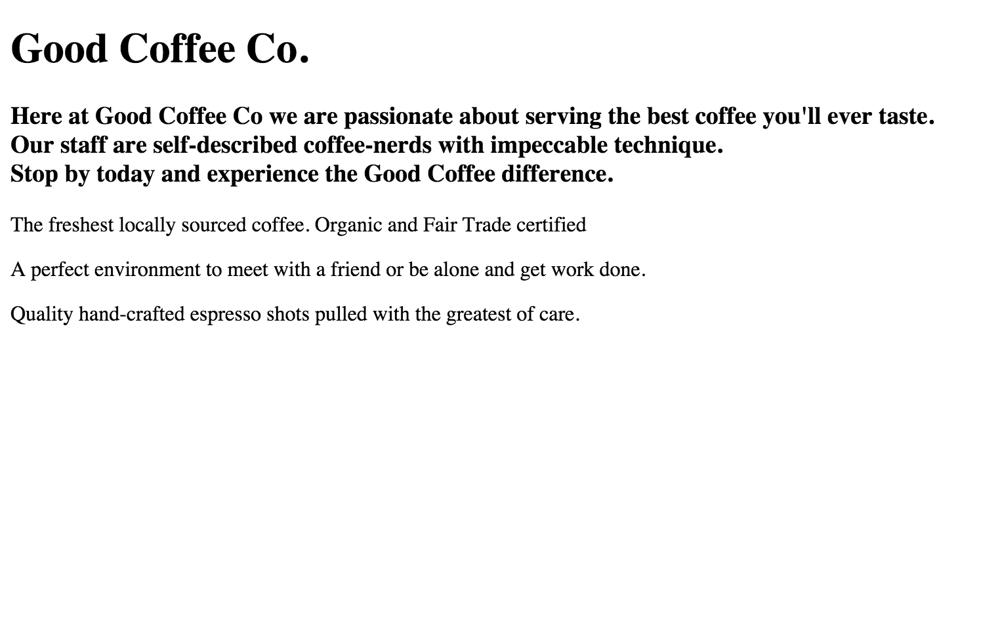
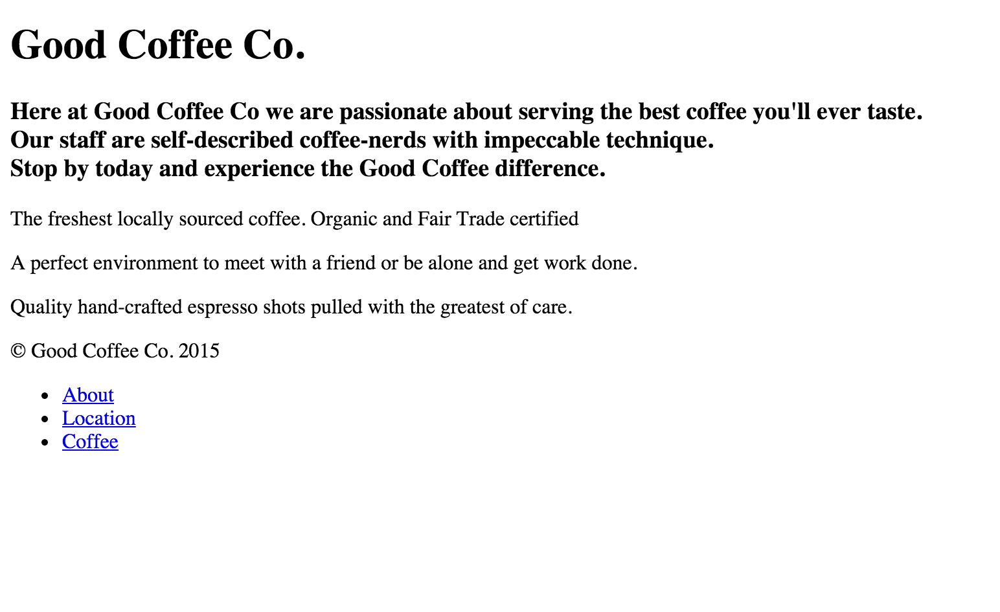
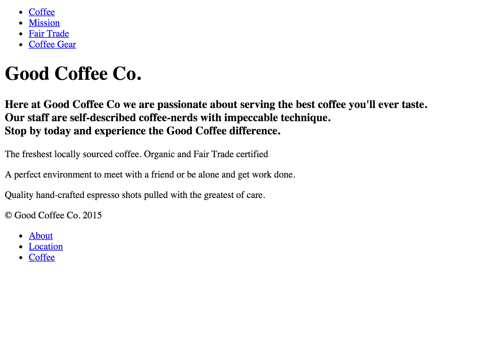
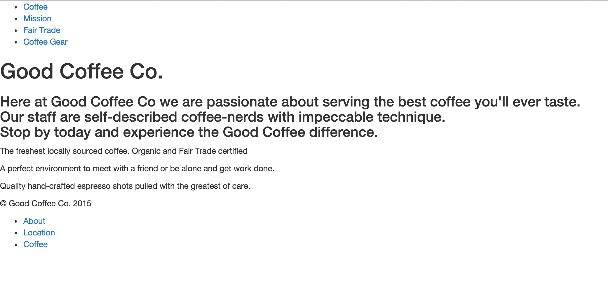
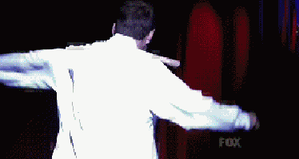
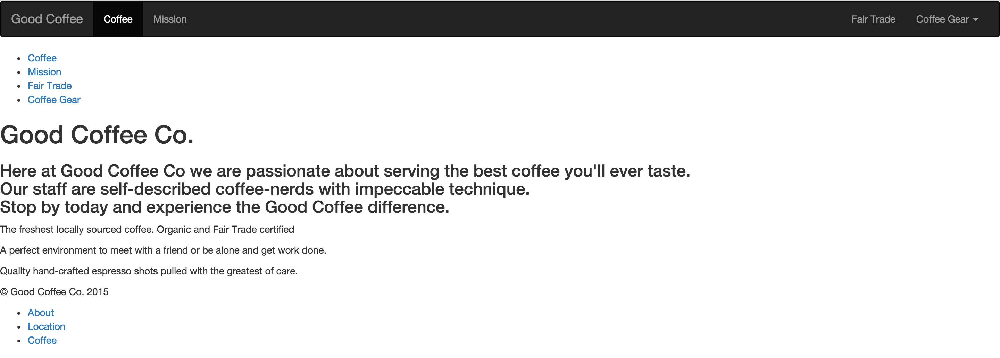
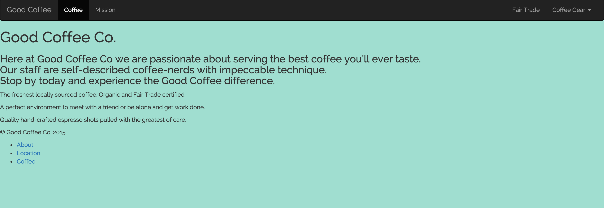
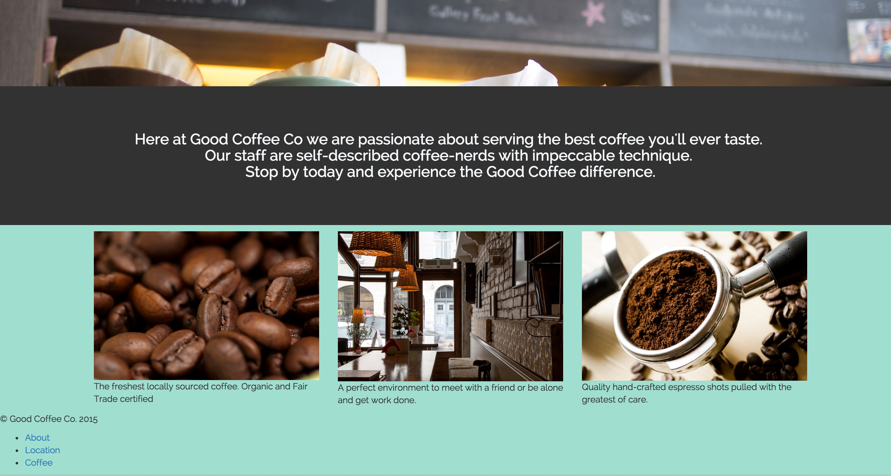
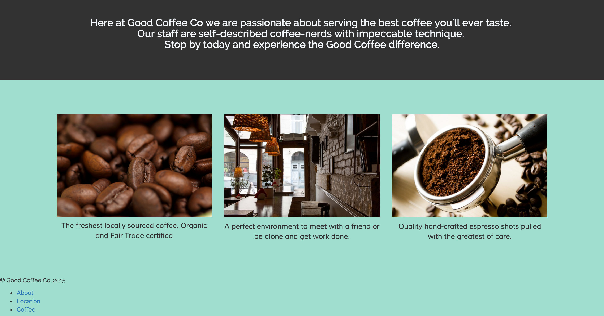

#Bootstrap 

Okay, so last class we worked with vanilla CSS, and you saw that positioning and styling your elements can become difficult and tedious very quickly. 

Thankfully, other developers have experienced the same pains, and decided to craft solutions that address the issues we've been facing. Those solutions come in the form of front-end frameworks like [Bootstrap](http://getbootstrap.com/) and [Zurb Foundations](http://foundation.zurb.com/)

- - - -

## Today's Objective

- Get familiar with bootstrap
	- How to install it in your project
	- The grid system
	- bootstrap compenents and classes
	- the docs
- Build a website quick and easy

- - - -
## Let's get started

As I've said before, the best way to learn is to build. So let's get started. 

Imagine that you've been approached by a local coffee shop to build their website. Together you've come up with a nice design and the shop has supplied you with all the necessary information(ie: copy, images and color scheme).

_Here is what you're aiming for:_


Oh, btw... the deadline is today. No time like the present to knock this out right?

**Challenge 1:** - Create the html page

Let's start with what we know. 

1. Create your html document
	2. At the top of the `<body>` wrap an `<h1>` in a `<div>` and insert the content 'Good Coffee Co.'
	3. Create another `<div>` and with `class` titled: 'mission'
		5. Create an `<h3>` and insert: 
		
			> Here at Good Coffee Co we are passionate about serving the best coffee you'll ever taste. Our staff are self-described coffee-nerds with impeccable technique. Stop by today and experience the Good Coffee difference.
	6. Create a new `<div>` with a `class` named: 'features'
		7. Create 3 separate paragraphs 
		8. Inside those paragraphs place the following text:
			
			>The freshest locally sourced coffee. Organic and Fair Trade certified. 
			
			>A perfect environment to meet with a friend or be alone and get work done. 
			
			>Quality hand-crafted espresso shots pulled with the greatest of care.
			
*Your page should look like this:*
 

**Challenge 1 Answer:**

```html
<!DOCTYPE html>
<html>
  <head>
    <meta charset="utf-8">
    <title>Good Coffee</title>
  </head>
  <body>

    <div >
      <h1> Good Coffee Co.</h1>
    </div>

    <div class="mission">
      <h3> Here at Good Coffee Co we are passionate about serving the best coffee you'll ever taste. 
      <br> Our staff are self-described coffee-nerds with impeccable technique.
      <br> Stop by today and experience the Good Coffee difference. 
      </h3>
    </div>


    <div class="features">
      <p> The freshest locally sourced coffee. Organic and Fair Trade certified</p>

      <p> A perfect environment to meet with a friend or be alone and get work done.</p>

      <p> Quality hand-crafted espresso shots pulled with the greatest of care.</p>
    </div>

  </body>
</html>

```

Okay, let's go ahead and put in the text for the footer as well. 


**Challenge 2** - The footer

1. Create a `<footer>`
2. Nest a `<p>` element in the `<footer>`
	3. Insert a [copyright](http://www.ascii.cl/htmlcodes.htm) symbol 
	4. Add the text: 

	 	> Good Coffee Co. 2015

5. Nest an *unordered list* inside the `<footer>` 
	6. Give the list 3 *list items* 
		7. About
		8. Location
		9. Coffee
	10. Turn those *list items* into *links* <br> *(hint: point the link to a "#")*
11. Close out the `<footer>` and refresh! 
   
**Result:**


<br>

**Challenge 2 Answer:**

```html
  <footer>
  	<p>&copy; Good Coffee Co. 2015</p>
  	<ul>
  		<li><a href="#">About</a></li>
  		<li><a href="#">Location</a></li>
  		<li><a href="#">Coffee</a></li>
  	</ul>
  </footer>
```  

Okay! we're well on our way to having a great site. The last bit of structure that we need is a navbar. 

**Challenge 3** The Navbar

1. At the top of the `<body>` create a `<nav>` element. <br> *The nav is an HTML 5 element that functions exactly like an unordered list. It mainly serves as an accessibility feature for screen readers. Additionaly, it helps the developer with code-readability*
2. Like you did with the `<footer>`, you'll want to create an *underderd list* and nest the following *list items*:
	3. Coffee
	4. Mission
	5. Fair Trade
	6. Coffee Gear

**The Result:**

 

*Note: If you didn't include the links, don't worry about it. We'll be modifying the navbar pretty significantly in just a few minutes.*

**Challenge 3 Answer:**

```html
<nav>
  <ul>
    <li><a href="#">Coffee</a></li>
    <li><a href="#">Mission</a></li>
    <li><a href="#">Fair Trade</a></li>
    <li><a href="#">Coffee Gear</a></li>
  </ul>
</nav>
```

And that's it! We are done with the structure. Now we can install bootstrap and start styling the page. 

- - - - 

## Install Bootstrap

Okay, so we've briefly discussed what bootstrap is and what it does, but how do we install it into our project?

Well... that's for you to figure out...


**Challenege 4** Install Bootstrap

There are several ways to include bootstrap in your project. Which one is correct? Well... it depends on the project. We are going to use a CDN (content delivery network) which is my preferred method and will work fine for this project. 

1. Go the [getting started](http://getbootstrap.com/getting-started/) section of the bootsrap documentation.
2. Review the Bootstrap CDN section and take the appropriate actions

<br>

**Challenge 4 Answer**

```html
<head>
	<meta charset="utf-8">
	
	<!-- Latest compiled and minified CSS -->
	<link rel="stylesheet" href="https://maxcdn.bootstrapcdn.com/bootstrap/3.3.5/css/bootstrap.min.css" integrity="sha512-dTfge/zgoMYpP7QbHy4gWMEGsbsdZeCXz7irItjcC3sPUFtf0kuFbDz/ixG7ArTxmDjLXDmezHubeNikyKGVyQ==" crossorigin="anonymous">
	
	<title>Good Coffee</title>

</head>
```

Let's go ahead and install JavaScript as well.<br>
Below your `<footer>` paste the following:

```html
<!-- Latest compiled and minified JavaScript -->
<script src="https://maxcdn.bootstrapcdn.com/bootstrap/3.3.5/js/bootstrap.min.js" integrity="sha512-K1qjQ+NcF2TYO/eI3M6v8EiNYZfA95pQumfvcVrTHtwQVDG+aHRqLi/ETn2uB+1JqwYqVG3LIvdm9lj6imS/pQ==" crossorigin="anonymous"></script>
<!-- Latest jQuery (without OldIE support-->
<script src="https://ajax.googleapis.com/ajax/libs/jquery/2.1.4/jquery.min.js"></script>
```

One more thing... this doesn't necessarily relate to bootstrap, but let's go ahead and create our main stylesheet (for custom styling). And you know how we roll, so go ahead and do all of this from the command line. 

from your project directory, create a new css directory

```bash
$ mkdir css
```
navigate to the directory

```bash
$ cd css
```
create the file

```bash
$ touch main.css
```

navigate back to the root of your project

```bash
$ cd ..
```

Now link the file to your index.html

```html
<link rel="stylesheet" href="css/main.css" media="screen" title="no title" charset="utf-8">
```
*Make sure you place this after the bootstrap link*

Now that we have everything setup, go ahead and refresh your page. 



You'll notice that our page has been 'normalized' (or reset). A browser reset is baked into bootstrap. yay!

- - - - 

## Nav

Okay... that navbar has to change... like... now... <br>
So, let's do that.

**Challenge 5 (part 1):** - Bootstrap Nav

1. Go to the [navbar](http://getbootstrap.com/components/#navbar) section of bootstrap's documentation.
2. READ
3. Start with applying the basic navbar to our site. <br> *(Don't worry about the content right now)*

Here's what it should look like:


**Challenge 5 (part 1) Answer:**

Nothing magical here. All you have to do is copy and paste directly from the boostrap site.


Now let's add our custom  links and make some slight modifications. 

**Challenge 5 (part2)** - Customize the navbar

1. Find and change 'Brand' to the name of the company
2. Find and replace the two 'Links' on the left with:
	3. Coffee
	4. Mission
	5. Refresh
	*here's what you should have:*
	
5. Now, remove the left dropdown menu and `<form>` (search bar and submit button)
6. modify the items on the right to say:
	7. Fair Trade
	8. Coffee Gear
9. Invert the color  

**The Result:**


**Challenge 5 (part 2) Answer:**

```html
<body>
  <nav class="navbar navbar-inverse">
    <div class="container-fluid">
      <!-- Brand and toggle get grouped for better mobile display -->
      <div class="navbar-header">
        <button type="button" class="navbar-toggle collapsed" data-toggle="collapse" data-target="#bs-example-navbar-collapse-1" aria-expanded="false">
          <span class="sr-only">Toggle navigation</span>
          <span class="icon-bar"></span>
          <span class="icon-bar"></span>
          <span class="icon-bar"></span>
        </button>
        <a class="navbar-brand" href="#">Good Coffee</a>
      </div>

      <!-- Collect the nav links, forms, and other content for toggling -->
      <div class="collapse navbar-collapse" id="bs-example-navbar-collapse-1">
        <ul class="nav navbar-nav">
          <li class="active"><a href="#">Coffee <span class="sr-only">(current)</span></a></li>
          <li><a href="#">Mission</a></li>
        </ul>

        <ul class="nav navbar-nav navbar-right">
          <li><a href="#">Fair Trade</a></li>
          <li class="dropdown">
            <a href="#" class="dropdown-toggle" data-toggle="dropdown" role="button" aria-haspopup="true" aria-expanded="false">Coffee Gear <span class="caret"></span></a>
            <ul class="dropdown-menu">
              <li><a href="#">Action</a></li>
              <li><a href="#">Another action</a></li>
              <li><a href="#">Something else here</a></li>
              <li role="separator" class="divider"></li>
              <li><a href="#">Separated link</a></li>
            </ul>
          </li>
        </ul>
      </div>
      <!-- /.navbar-collapse -->
    </div>
    <!-- /.container-fluid -->
  </nav>
```    
 
 
  
  Go ahead and delete the original nav (as we no longer need it).

- - - - 

## Font

I've already picked out a font from google fonts, so let's go ahead and add that into our project

In the `<head	>` of your html document, paste the following:

```html
  <!-- font family below -->
  <link href="http://fonts.googleapis.com/css?family=Muli|Raleway:400,500,700|Yanone+Kaffeesatz" rel="stylesheet" type="text/css">
```

In your main.css file, type the following: 

```css
body {
  font-family: 'Raleway', 'sans-serif'
}
```


- - - -


## Color Scheme

I've also picked out a color scheme (feel free to change it up)

We'll be using `#A2DED0` as our primary color.<br>
`#323232` and `#D645651` will be our secondary colors. 

Go ahead and apply the primary color to the background of our `<body>`. 

```css
background-color: #A2DED0;
```



Okay, it's already starting to feel better. Next up. the hero image!

- - - -

## Jumbotron

If you look at most well-designed websites, you'll see some kind of hero image and/or captivating header at the top of the page. This is often called a hero image. In bootstrap we'll use the `.jumbotron` class to style our hero image. 

First let's start with a picture. You can use [this URL](https://upload.wikimedia.org/wikipedia/commons/6/62/Drip_Coffee_Bangkok.jpg) and link to it directly in your CSS. Or create an images directory and store the image there. <br> I would prefer for you to do choose the second option

**Challenge 6 (part 1)** - Create an image directory and display your hero image

1. Just like we created the css directory. Create an images directory
2. Assign the `class` "jumbotron" to the `<div>` surrounding your `<h1>`
3. In your css, use the `background-image` property to display the hero image. 
*(hint: use [css documentation](http://www.w3schools.com/cssref/pr_background-image.asp) if you need help with the background image*)

Don't worry about how this looks at the moment. In part 2, we'll style it. 

**Challenge 6 (part 1) Answer**

From your project root run: `$ mkdir images`

In your html:

```html
<div class="jumbotron">
  <h1> Good Coffee Co.</h1>
</div>
```

In your css:

```css
.jumbotron {
  background-image: url("../images/Drip_Coffee_Bangkok.jpg");
}
```

If you refresh... it isn't pretty. let's fix that.

**Challenge 6 (part2)** - Style your hero image

1. For the image... within the `.jumbotron` declaration:
	2. set the `background-repeat` to no-repeat
	3. set the `background-size` to cover
	4. assign a `width` of 100%
5. Position the image 
	6. draw the top margin up by 40px
	7. padding (on all sides) = 20%
	8. `background-attachment` = fixed
	9. `background-position` = center -238px
	10. Save and Refresh!
At this point, your page should should look like: 


11. Now we need to style the `<h1>`
	12. set the `position` to absolute
	13. move it 0 left and 18 from the top
	14. assign left padding of 20px
	15. give the font a color of `#F7FAFE`
	16. Save and refresh!

You should have something like this:


The header isn't exactly where we want it. but let's keep moving (we can tweak later)

**Challenge 6 (part 2) Answer:** 

```css
.jumbotron {
	background-image: url("../images/Drip_Coffee_Bangkok.jpg");
	padding: 20%;
	background-repeat: no-repeat;
	background-size: cover;
	width: 100%;
	margin-top: -40px;
	background-attachment: fixed;
	background-position:  center -238px;
}

.jumbotron h1 {
	position: absolute;
	top:18;
	left:0;
	padding-left: 20px;
	color: #F7FAFE;
}
```

- - - -

## Mission 

Let's talk about containers for a moment. <br>
With most web design, you're going to want to establish very clear containers for groups of elements. `<div>`'s serve for this purpose. However, what about when you want to group a set of `<div>`'s together? 

Your best bet is to establish a container `<div>`

So, we're going to create a some containers. 

**Challenge 7**

1. Add a class of 'container-fluid' to your 'mission' `<div>`
2. Nest a `<div>` with the class of 'row'
3. Move your `<h3>` inside of the 'row' `<div>`
4. above your `<h3>` paste the following code `<a name="mission"></a>`<br> (this allows us to navigate around the page)
5. Style the mission `<div>`!
	6. Set the background color to `#323232`
	7. Set the text color to `#F7FAFE`
	8. Move the top margin up by 30px
9. Specifically style the `<h3>`
	10. set a padding of 5% top/bottom and 10% left/right
	11. center the text

**The Result:**


**Challenge 7 Answer:**

in your index.html:

```html
<div class="mission">
    <h3> Here at Good Coffee Co we are passionate about serving the best coffee you'll ever taste.
    <br> Our staff are self-described coffee-nerds with impeccable technique.
    <br> Stop by today and experience the Good Coffee difference. 
    </h3>
</div>
```

in your main.css:

```css
.mission {
	background-color: #323232;
	color: #F7FAFE;
	margin-top: -30px;
}

.mission h3 {
	padding: 5% 10% ;
	text-align: center;
}
```

Next up the Grid!

## The Grid

One of the best features of using front-end frameworks is [the grid system](http://getbootstrap.com/css/#grid). Grid's allow for much easier positioning than working with standard css positioning. 

The concept is simple...
<br>
Divide the page into 12 columns. and then move content along those columns. This makes laying out your content incredibly simple (and helps with responsive design). So it's a win-win.

**Challenge 8**

1. Take 2 minutes and read the [Introduction](http://getbootstrap.com/css/#grid) to bootstrap's grid. 
2. Add the container class to your features `<div>`
3. Nest your existing `<div>`'s within a row class
4. Wrap each `<p>` in it's own `<div>`
5. Using bootstrap's grid. make each `<div>` (within the row) span 4 columns on small devices. 

**The Result:**


**Challenge 8 Answer:**

```html
<div class="container features">
    <div class="row">
      <div class="col-sm-4">
        <p> The freshest locally sourced coffee. Organic and Fair Trade certified</p>
      </div>
      <div class="col-sm-4">
        <p> A perfect environment to meet with a friend or be alone and get work done.</p>
      </div>
      <div class="col-sm-4">
        <p> Quality hand-crafted espresso shots pulled with the greatest of care.</p>
      </div>
    </div>
  </div>
```

We're getting there! 

Let's go ahead and add the images. 

**Challenge 9** - Feature Images

1. Add these pictures to your images folder 
	2. [coffee_beans](http://upload.wikimedia.org/wikipedia/commons/3/3f/Coffee_Beans.jpg)
	3. [coffee_shop](http://pixabay.com/static/uploads/photo/2014/07/15/13/36/coffee-shop-393954_640.jpg)
	4. [espresso](http://pixabay.com/static/uploads/photo/2013/11/05/23/55/coffee-206142_640.jpg) 
5. In the html, create an `` tag for each div (containing a paragraph) and change `src` attribute to display your new images.
6. Save and refresh

Got it?

Yeah... it's bad... real bad... the images are being displayed at their stock resolution. Thankfully, bootstrap offers a class that easily fixes this to make the images respond to the grid.

simply assign the class 'img-responsive' to your `` element like so: ``

Afterwards. Your page should look like this: 



Nice! Now we just need to add a touch of styling and this container is good-to-go!

**Challenge 10** - Style the features container. 

1. Set the features' container padding to 5% top/bottom and 0 left/right
2. For the paragraphs:
	3. Change the font to 'Muli' with a fallback of 'sans-serif'
	4. align the text to center
	5. set the font size to 1.2em
	6. give a top padding of 10px 
	7. change the color to #323232
8. Save and refresh

You should see something like this:

 

**Challenge 10 Answer:**

```css
.features {
	padding: 5% 0;
}

.features p {
	font-family: 'Muli' 'sans-serif';
	text-align: center;
	color: #323232;
	font-size: 1.2em;
	padding-top: 10px;
}
```


